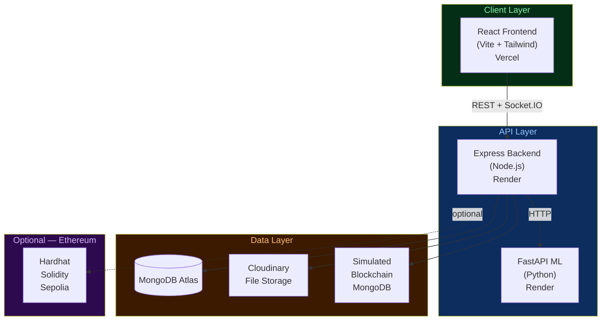
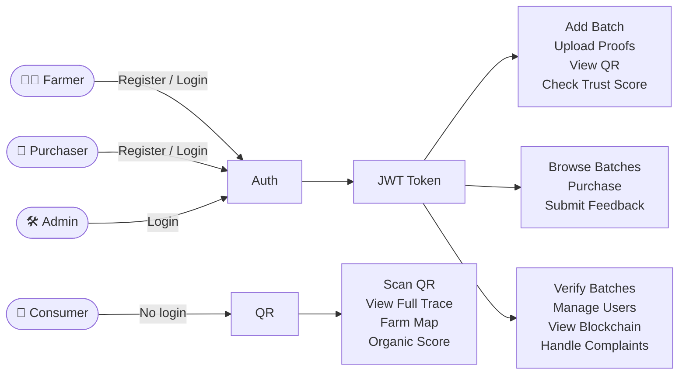
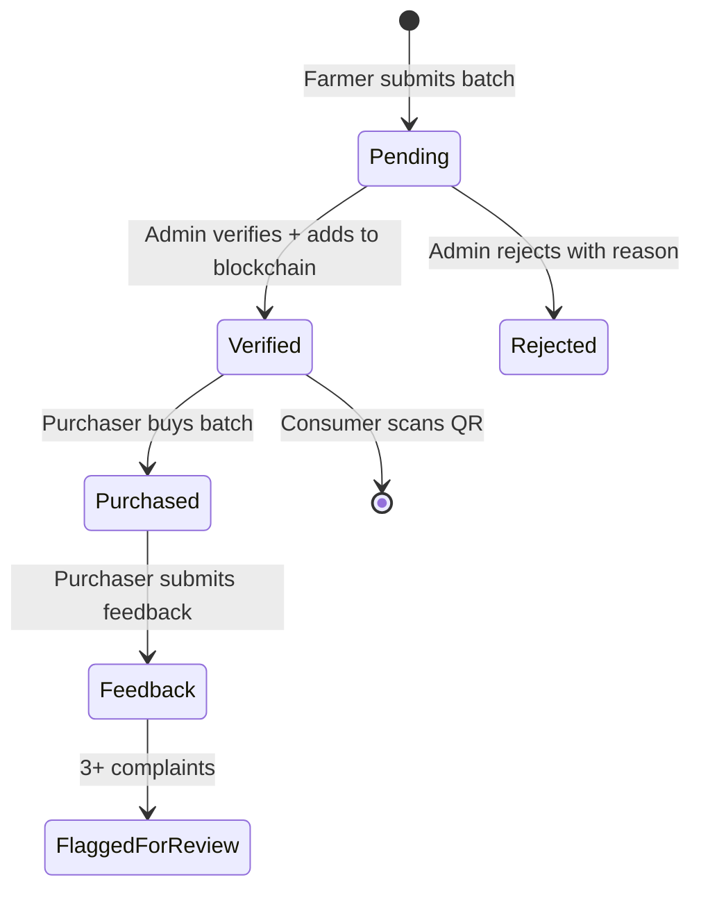
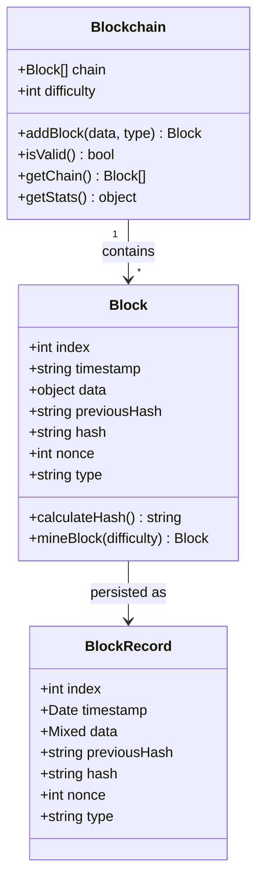
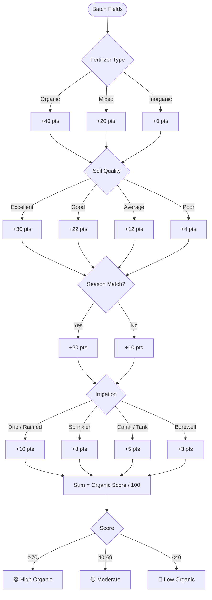
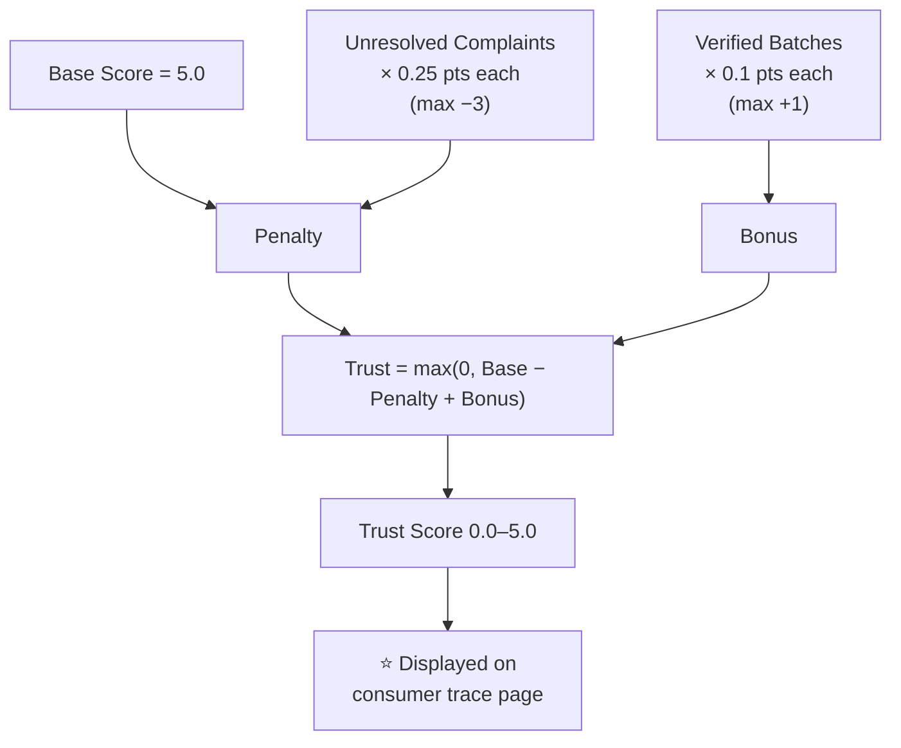
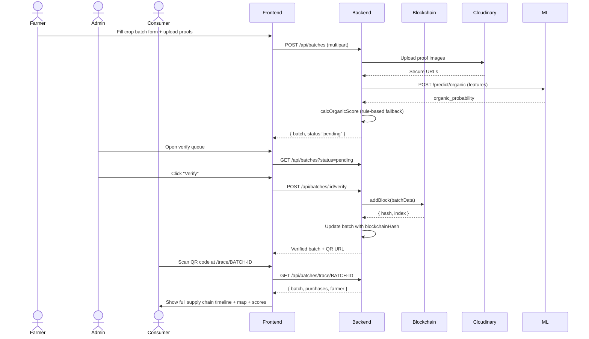
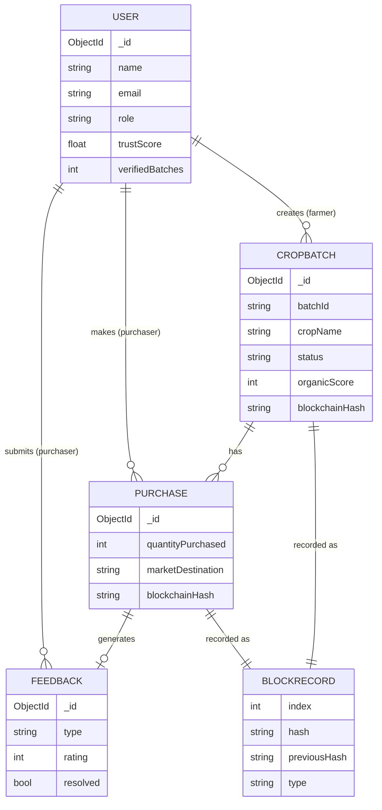

# Farm to Plate — UML & Architecture Diagrams

All diagrams use Mermaid syntax. Render at https://mermaid.live

---

## 1. System Architecture

---

## 2. User Role Flow

---

## 3. Crop Batch Lifecycle

---

## 4. Blockchain Block Structure

---

## 5. Organic Score Algorithm

---

## 6. Trust Score System

---

## 7. Sequence Diagram — Batch Creation to Consumer Scan

---

## 8. ER Diagram

